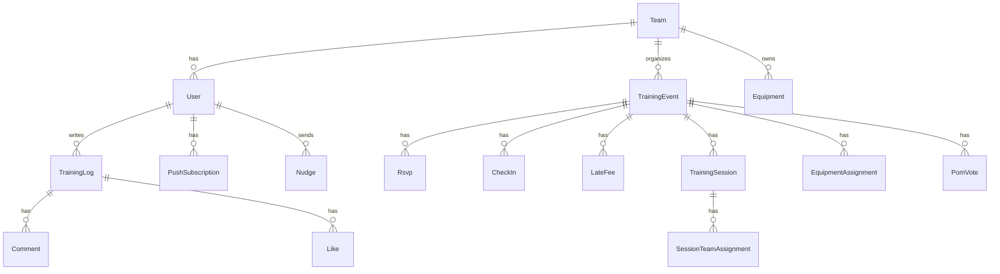

# 네모의 꿈 - 프로젝트 개요

## 📱 서비스 소개

**네모의 꿈**은 풋살/축구 동호회를 위한 올인원 SNS 플랫폼입니다.

### 핵심 가치

- 🏃 **운동 일지 공유**: 개인/팀 운동 기록을 폴라로이드 스타일로 공유
- ⚽ **팀 운동 관리**: RSVP, 체크인, 팀 배정, 조끼 당번 등 운영 자동화
- 💬 **팀 소통**: 댓글, 좋아요, 닦달, 푸시 알림으로 활발한 팀 문화 형성
- 📊 **데이터 기반 관리**: 출석률, POM 투표, 장비 관리 등 체계적 팀 운영

---

## 🎯 타겟 사용자

### 1차 타겟: 정기적으로 활동하는 동호회

- 주 1회 이상 정기 운동
- 10~30명 규모의 팀
- 카톡 단톡방으로 관리 중
- RSVP/출석 체크 필요
- 조끼, 공 등 장비 관리 필요

### 사용자 페르소나

**운영진 (ADMIN)**
- 운동 일정 생성 및 관리
- 팀 배정 및 세션 구성
- 조끼/장비 담당자 지정
- 지각비 관리

**팀원 (MEMBER)**
- 참석 여부 응답 (RSVP)
- 운동 일지 작성 및 공유
- 댓글, 좋아요로 소통
- POM 투표 참여
- 닦달로 팀원 독려

---

## 🏗️ 기술 스택

### Frontend
- **Framework**: Next.js 15 (App Router)
- **Language**: TypeScript
- **Styling**: Tailwind CSS v4
- **State**: React Context API + SWR
- **Auth**: NextAuth.js (Google OAuth)

### Backend
- **Runtime**: Node.js
- **API**: Next.js API Routes
- **ORM**: Prisma
- **Database**: PostgreSQL (Neon)
- **Storage**: Cloudinary (이미지 업로드)

### Infrastructure
- **Hosting**: Vercel
- **Database**: Neon (PostgreSQL)
- **CDN**: Cloudinary
- **Push Notification**: Web Push API (VAPID)
- **Cron Jobs**: Vercel Cron

### Dev Tools
- **Package Manager**: npm
- **Linting**: ESLint
- **Type Checking**: TypeScript

---

## 📐 디자인 시스템

### 브랜드 컬러

**Primary Color**: `#967B5D` (따뜻한 브라운)

```css
team-50:  #F5F0EB  /* 배경, 폴라로이드 내부 */
team-100: #E8DDD3
team-200: #D4C3B2
team-300: #BFA990
team-400: #AB906F
team-500: #967B5D  /* 메인 컬러 */
team-600: #7A6349
team-700: #685643  /* 진한 텍스트 */
team-800: #463A2E
team-900: #2E271F
```

### 타이포그래피

- **폰트**: Pretendard (Variable)
- **제목**: 600 (SemiBold)
- **본문**: 400 (Regular)
- **강조**: 500 (Medium)

### 디자인 컨셉

**폴라로이드 스타일**
- 흰색 외곽 프레임 (12px padding)
- `bg-team-50` 내부 사진 영역
- Subtle shadow: `0px 2px 12px rgba(0,0,0,0.15)`

**레이아웃**
- 전광판 배너 (상단 고정)
- 헤더 네비게이션 (+, 사용자 아이콘)
- 하단 탭 없음 (깔끔한 UI)

---

## 🗂️ 프로젝트 구조

```
football-log/
├── src/
│   ├── app/                    # Next.js App Router 페이지
│   │   ├── page.tsx            # 피드 (홈)
│   │   ├── (auth)/
│   │   │   └── login/          # 로그인
│   │   ├── onboarding/         # 온보딩 (팀 생성/가입)
│   │   ├── write/              # 일지 작성
│   │   ├── log/[id]/           # 일지 상세
│   │   ├── training/
│   │   │   ├── create/         # 팀 운동 생성
│   │   │   ├── [id]/           # 팀 운동 상세
│   │   │   ├── [id]/edit/      # 팀 운동 수정
│   │   │   └── [id]/manage/    # 팀 운동 관리 (운영진 전용)
│   │   ├── my/                 # 마이페이지
│   │   │   ├── logs/           # 내 일지 목록
│   │   │   ├── training/       # 내 참석 운동
│   │   │   ├── training-events/# 내가 만든 운동
│   │   │   ├── settings/       # 설정 (푸시 알림 등)
│   │   │   ├── team-admin/     # 팀 운영진 관리
│   │   │   ├── team-settings/  # 팀 설정
│   │   │   └── team-equipment/ # 팀 장비 관리
│   │   └── api/                # API Routes
│   ├── components/             # React 컴포넌트
│   ├── contexts/               # React Context
│   ├── lib/                    # 유틸리티 함수
│   └── types/                  # TypeScript 타입
├── prisma/
│   └── schema.prisma           # 데이터베이스 스키마
├── public/
│   ├── custom-sw.js            # Service Worker (Push)
│   └── icons/                  # PWA 아이콘
├── docs/                       # 문서
│   ├── PROJECT_OVERVIEW.md     # 이 문서
│   ├── FEATURES.md             # 기능 명세서
│   ├── API_SPEC.md             # API 명세서
│   └── PUSH_NOTIFICATION.md    # 푸시 알림 기획
└── footballlog.pen             # Pencil 디자인 파일
```

---

## 🔑 핵심 기능 요약

### 1. 운동 일지 (Training Log)
- 개인 운동 또는 팀 운동 기록
- 컨디션 점수 (0-10)
- 사진 업로드 (Cloudinary)
- 좋아요, 댓글, 태그 (@mention)

### 2. 피드 (Feed)
- 폴라로이드 스타일 카드
- 날짜별 스택 (오늘, 어제, 이틀 전...)
- 탭하여 수평 캐러셀 확장
- 전광판 배너 (닦달 + 활동 메시지)

### 3. 팀 운동 관리 (Training Event)
- 일정 생성 (날짜, 장소, 복장, RSVP 마감)
- 참석/지각/불참 응답 (RSVP)
- 체크인 및 지각비 관리
- 세션별 팀 배정 (A팀, B팀, C팀...)
- 조끼 당번 자동 추천
- 장비 담당자 배정

### 4. POM (Player of the Match)
- 운동 후 MVP 투표
- 투표 마감 시간 설정
- 1인 1표 또는 복수 투표 가능
- 최근 POM 통계

### 5. 푸시 알림 (Push Notification)
- Web Push API (VAPID)
- 10가지 알림 시나리오 ([상세 보기](PUSH_NOTIFICATION.md))
  - 닦달, RSVP 리마인더, 팀 배정, 좋아요, 댓글, 새 일지, 지각비, 새 운동, 조끼 담당

### 6. 닦달 (Nudge)
- 팀원에게 운동 일지 작성 독려
- 1시간 1회 제한 (스팸 방지)
- 푸시 알림 발송

### 7. 팀 관리
- 초대 코드로 팀 가입
- 운영진 (ADMIN) 여러 명 지정 가능
- 팀 컬러, 로고 커스터마이징
- 조끼 당번 순서 관리
- 장비 목록 및 담당자 관리

### 8. 출석 통계
- 팀원별 출석률
- 평균 참석 인원
- 지각 통계

---

## 🔐 권한 체계

### Role 구분

| 권한 | 설명 | 가능한 작업 |
|-----|------|-----------|
| **ADMIN** | 운영진 | 모든 기능 + 팀 운동 관리, 팀 배정, 지각비, 조끼/장비 관리 |
| **MEMBER** | 일반 팀원 | 일지 작성, 댓글, 좋아요, RSVP, POM 투표 |

### 권한 관리

- 팀 생성자는 자동으로 ADMIN
- ADMIN은 다른 팀원을 ADMIN으로 지정 가능
- ADMIN은 다른 ADMIN의 권한을 해제 가능
- 팀 생성자는 해제 불가

---

## 📊 데이터 모델 개요

### 핵심 엔티티



### 주요 모델

- **User**: 사용자 (Google OAuth)
- **Team**: 팀 (초대 코드, 조끼 순서)
- **TrainingLog**: 운동 일지
- **Comment**: 댓글 (멘션 지원)
- **Like**: 좋아요
- **TrainingEvent**: 팀 운동 일정
- **Rsvp**: 참석 여부 응답
- **CheckIn**: 체크인 (지각 여부)
- **LateFee**: 지각비
- **TrainingSession**: 세션 (경기, 훈련 등)
- **SessionTeamAssignment**: 세션별 팀 배정
- **Equipment**: 장비 (공, 조끼 등)
- **EquipmentAssignment**: 운동별 장비 담당
- **PomVote**: MVP 투표
- **PushSubscription**: 푸시 알림 구독
- **Nudge**: 닦달

---

## 🚀 배포 환경

### Production
- **URL**: https://football-log.vercel.app (예시)
- **Platform**: Vercel
- **Database**: Neon PostgreSQL
- **CDN**: Cloudinary

### Development
- **Local**: http://localhost:3000
- **Database**: Local PostgreSQL 또는 Neon Dev

### 환경 변수

```bash
# .env
DATABASE_URL="postgresql://..."
DIRECT_URL="postgresql://..."
NEXTAUTH_URL="http://localhost:3000"
NEXTAUTH_SECRET="..."
GOOGLE_CLIENT_ID="..."
GOOGLE_CLIENT_SECRET="..."
CLOUDINARY_CLOUD_NAME="..."
CLOUDINARY_API_KEY="..."
CLOUDINARY_API_SECRET="..."
NEXT_PUBLIC_VAPID_PUBLIC_KEY="..."
VAPID_PRIVATE_KEY="..."
```

---

## 📱 사용자 플로우

### 신규 사용자

1. **로그인**: Google 계정으로 로그인
2. **온보딩**: 팀 생성 또는 초대 코드로 가입
3. **프로필 설정**: 이름, 포지션, 등번호 입력
4. **피드 진입**: 팀원들의 일지 확인

### 일반적인 사용 패턴

**운동 전**
1. 운영진이 팀 운동 생성
2. 팀원들 RSVP 응답
3. RSVP 마감 2시간 전 리마인더 푸시 알림
4. 운영진이 팀 배정 완료 → 푸시 알림

**운동 중**
1. 운영진이 체크인 (지각 여부 기록)
2. 지각비 부과 → 푸시 알림

**운동 후**
1. 팀원들 일지 작성 → 팀 전체에 푸시 알림
2. 댓글, 좋아요로 소통
3. POM 투표 참여
4. 닦달로 일지 미작성자 독려

---

## 🎨 디자인 파일

**Pencil 파일**: `footballlog.pen`

### 주요 화면 (Node ID)

| 화면 | Node ID | 설명 |
|-----|---------|------|
| Feed | k6Oof | 피드 메인 화면 |
| Write | 9Eymy | 일지 작성 |
| Detail | SifmW | 일지 상세 |
| MyPage | yhi7O | 마이페이지 |
| Login | D6Gjb | 로그인 |
| Onboarding | SWo6j | 온보딩 |

---

## 📈 향후 로드맵

### Phase 1: MVP (완료)
- ✅ 기본 인증 (Google)
- ✅ 팀 생성/가입
- ✅ 운동 일지 작성/공유
- ✅ 댓글, 좋아요
- ✅ 팀 운동 관리 (RSVP, 체크인)
- ✅ 푸시 알림

### Phase 2: 운영 자동화 (현재)
- ✅ 팀 배정 시스템
- ✅ 조끼 당번 자동화
- ✅ 장비 관리
- ✅ POM 투표
- ✅ 지각비 관리

### Phase 3: 고도화 (예정)
- [ ] 알림 세분화 (선택적 구독)
- [ ] 통계 대시보드
- [ ] 팀 간 매치 메이킹
- [ ] 경기 영상/하이라이트 공유
- [ ] 개인 기록 추적 (골, 어시스트)

### Phase 4: 확장 (장기)
- [ ] 모바일 앱 (React Native)
- [ ] 대회 관리 시스템
- [ ] 팀 랭킹 및 리그 시스템
- [ ] 용병 구인/구직 게시판

---

## 🤝 팀 & 연락처

**개발**: Claude Sonnet 4.5 (AI Assistant)
**기획/디자인**: Pencil Design System
**프로젝트 시작**: 2026-02
**라이선스**: MIT (예시)

---

**최종 수정일**: 2026-02-09
**버전**: 1.0.0
